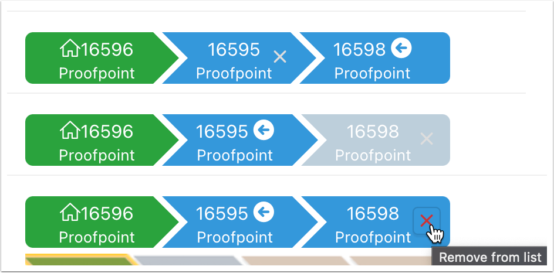

# Crumbs

## What is this?
The Crumbs is a small module that helps you keep a stack of elements similar to a breadcrumb trail.

It's meant ti be used as a user navigation aid. As the user visit different elements the entries as "pushed" into the stack and "poped" as the navigate to earier entries.

## Example




## Configuration

Use the following classes to enable the Actions menu or the "To Do" functionality.

`js-hasActions` : With this class the Actions menu will be visible allowing for user configured menu of options. For example: "Clear all Crumbs", "Apply Filter to report", etc..


`js-hasTodo`: Adds the ability to have a checkbox to complete a "Crumb" as if it was a TODO item.


## Template

There are several way to implement the template, but here's a starting point.

Before Rows

```
<button type="button" title="Filter" aria-label="Filter" class="crumbActionsBtn t-Button t-Button--noLabel t-Button--icon js-menuButton" data-menu="crumbsMenu">
<span class="a-Icon icon-down-arrow"></span>
</button>
<ul class="#COMPONENT_CSS_CLASSES#" id="L#LIST_ID#">
```

Current Item

```
<li class="active current #A02#" data-crumbid="#A04#" data-entityid="#A07#">
  <a href="#LINK#" title="#A03#" class="#A01#">
    <span class="t-Icon #ICON_CSS_CLASSES#" #IMAGE_ATTR#></span>
    #TEXT#
    <span title="Complete?" class="checkCrumb" data-crumbid="#A04#"><i class="fa fa-#A06#square-o"></i></span>
    <span title="Remove from list" class="removeCrumb allow#A05# t-Button t-Button--noUI t-Button--small" data-crumbid="#A04#"><i class="fa fa-times"></i></span>
  </a>
</li>
```


Non-Current Item

```
<li class="active #A02#" data-crumbid="#A04#" data-entityid="#A07#">
  <a href="#LINK#" title="#A03#" class="#A01#">
    <span class="t-Icon #ICON_CSS_CLASSES#" #IMAGE_ATTR#></span>
    #TEXT#
    <span title="Complete?" class="checkCrumb" data-crumbid="#A04#"><i class="fa fa-#A06#square-o"></i></span>
    <span title="Remove from list" class="removeCrumb allow#A05# t-Button t-Button--noUI t-Button--small" data-crumbid="#A04#"><i class="fa fa-times"></i></span>
  </a>
</li>
```


After Rows

```
</ul>
```

Execute When Page Loads.  This code removes the optional Crumbs Actions Button when the list is empty in order to save space.

```
var $l = $("#" + "L#LIST_ID#"),
    c = $l.find("li").length;
if (c===0) {$(".crumbActionsBtn").hide(); $l.hide()}
```


